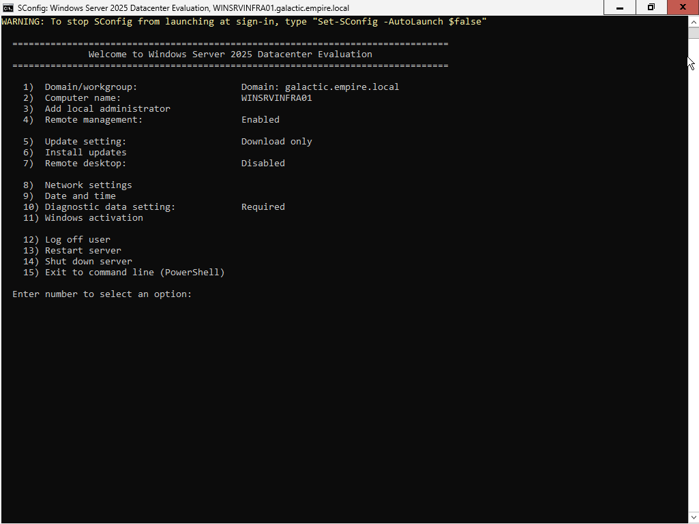
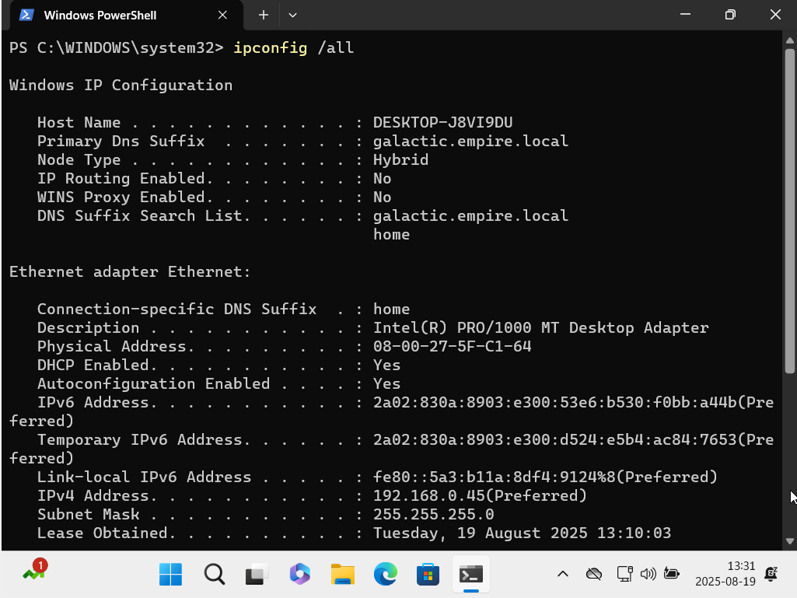

# windows-server-admin-lab

A comprehensive lab environment designed to showcase my Windows Server system administration skills, best practices, and automation techniques.

## Features
- Automated deployment and configuration of Active Directory
- Organizational Unit (OU) design and management
- Bulk user creation and management
- Group Policy Object (GPO) configuration for security and customization
- Installation and configuration of essential server roles (AD DS, DNS, File Services)
- Security hardening, backup, and recovery strategies
- Remote management and hybrid cloud integration

## Purpose
This project is a personal portfolio to demonstrate my practical Windows Server administration skills to potential employers. All scripts, configurations, and documentation are created and maintained by me.

## Windows Server 2025 Lab Image
- [Download Evaluation ISO](https://go.microsoft.com/fwlink/?linkid=2293312&clcid=0x409&culture=en-us&country=us)
- Version: 26100.1742.240906-0331.ge_release_svc_refresh_SERVER_EVAL_x64FRE_en-us.iso

## Quick Download & Extract
To download and extract this lab to `C:\Temp` in one line, run:
```
New-Item -ItemType Directory -Path 'C:\Temp' -Force | Out-Null; Invoke-WebRequest -Uri 'https://github.com/LudvigAlmvaang/windows-server-admin-lab/archive/refs/heads/main.zip' -OutFile 'C:\Temp\lab.zip'; Expand-Archive -Path 'C:\Temp\lab.zip' -DestinationPath 'C:\Temp' -Force
```

## Script Execution Policy
If you see an error like:

```
ServerRoles.ps1 cannot be loaded. The file ServerRoles.ps1 is not digitally signed. You cannot run this script on the current system.
```

Run the following command in PowerShell before executing the script:

```
Set-ExecutionPolicy -Scope Process -ExecutionPolicy Bypass
```

For more information, see [about_Execution_Policies](https://go.microsoft.com/fwlink/?LinkID=135170).

## Join a User Computer to the Domain
To join a user computer to the domain `galactic.empire.local`, run this as Administrator:
```
Set-DnsClientServerAddress -InterfaceAlias (Get-NetAdapter | Where-Object {$_.Status -eq 'Up'} | Select-Object -First 1).Name -ServerAddresses 192.168.0.25; Add-Computer -DomainName galactic.empire.local -Restart
```

## Screenshots




---
Created and maintained by Ludvig Almvaang.
